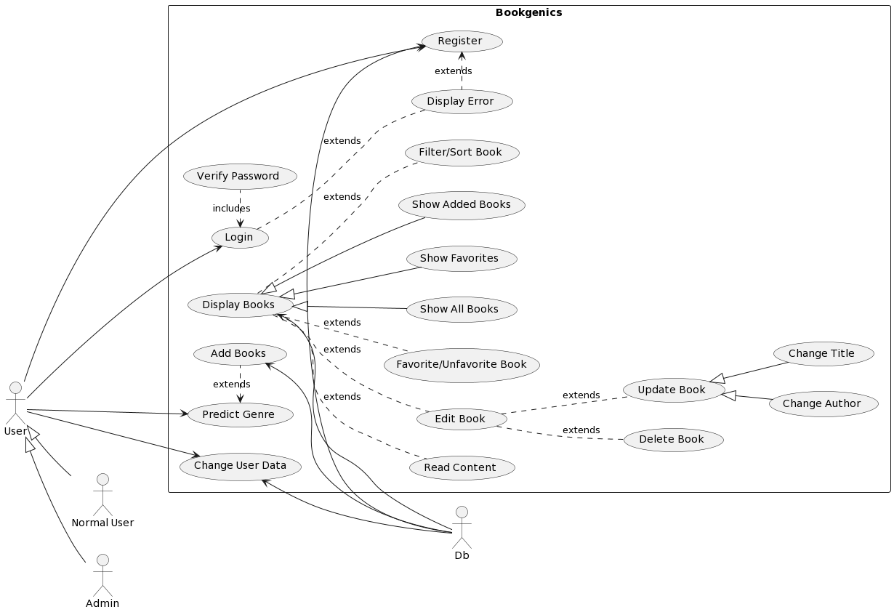
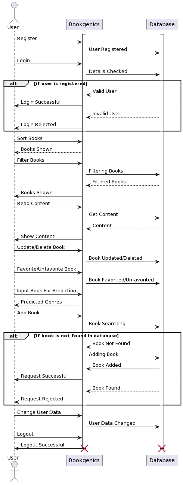

# BookGenics
<strong>This is the AI Powered Story Book Genre Classifier </strong>

<h3>Instructions</h3>
1. Clone the repo.

## For Server Dependencies
1. Install node.
2. Open terminal in server folder directory.
3. Run `npm i`.
4. Run `pip install -r requirements.txt`.

## Run Server

1. Run `node index.js` or `nodemon index.js` in server directory.

## Install Client Dependencies

1. Open terminal in client folder directory.
2. Run `npm i`.

## Run Client

1. Run `npm start` in client directory.

This project uses NLP and MERN stack integrated together for working.

## UseCase Diagram
&nbsp;&nbsp;&nbsp;&nbsp; 

## Sequence Diagram
&nbsp;&nbsp;&nbsp;&nbsp; 